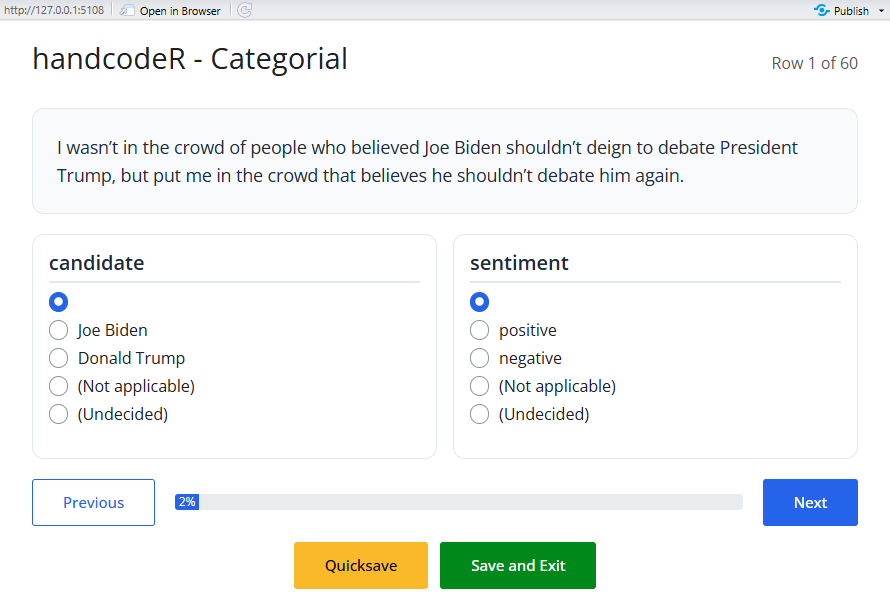

```{css, include = FALSE}
p {
  text-align: justify
}
```

# handcodeR 

[](https://app.codecov.io/gh/liserman/handcodeR)
[](https://cran.r-project.org/package=handcodeR)
[](https://cran.r-project.org/package=handcodeR)
[](https://cran.r-project.org/package=handcodeR)
[](https://cran.r-project.org/package=handcodeR)
[](https://zenodo.org/badge/latestdoi/608736610)

```{r, include = FALSE}
knitr::opts_chunk$set(
  collapse = TRUE,
  warning = FALSE,
  message = FALSE,
  comment = "#>",
  fig.path = "man/figures/",
  out.width = "100%"
)
```


# handcodeR

R-Package to facilitate the annotation of text data by hand in R.


The goal of the handcodeR package is to provide an easy to use app to annotate text data by hand. Often times when we work with text data, we rely on hand coded annotations of texts either as unit of analysis in itself, or as training and test samples for supervised machine learning tools to classify text data. handcodeR offers a Shiny-App that can be run within R to annotate individual texts one by one in up to six different variables. To do so, the package uses the function `handcode()`:

- `handcode()` opens a Shiny-App which allows for hand-coding strings of text into pre-defined categories. You can code between one and six variables at a time. It returns a data frame with your coded annotations.


I present a short step-by-step guide as well as the functions in more detail below.


## How to cite this package

To cite the handcodeR package, you can use:

> Isermann, Lukas. (2023). handcodeR: Text annotation app.
> R package version 0.2.0.
> <http://doi.org/10.5281/zenodo.8075100>.

You can also access the preferred citation as well as the bibtex entry for the handcodeR Package via R:

```{r}
citation("handcodeR")
```


## Installation

A stable version of `handcodeR` can be directly accessed on CRAN:

```{R, message = FALSE, warning = FALSE, results = "hide", eval = FALSE}
install.packages("handcodeR", force = TRUE)
```

To install the latest development version of `handcodeR` directly from [GitHub](https://github.com/liserman/handcodeR) use:

```{R, message=FALSE, warning=FALSE, results = "hide", eval=FALSE}
library(devtools) # Tools to Make Developing R Packages Easier
devtools::install_github("liserman/handcodeR", force = TRUE)
```

## How to use this package

First, load the package

```{R, message=FALSE, warning=FALSE}
library(handcodeR) # classify texts by hand in R
```

In the following, we are going to exemplify the workflow of the package using a minimal working example.

The workflow of the package follows a simple rule:

1. **Starting a new coding session:**
   - Initialize coding with `handcode()` by providing a **character vector** of texts you wish to annotate as the `data` input.
   - Supply up to six **named character vectors** defining the categories you want to code.
   - Hand-code as much data as you like and save your progress by clicking the **“Save and exit”** button. This will return a data frame containing your annotations.

2. **Resuming an existing coding session:**
   - Continue coding by providing the **data frame output** from your previous `handcode()` session as the `data` input.
   - This allows you to pick up where you left off without losing any previous annotations.


### handcode

The main function of the **handcodeR** package is `handcode()`. 

`handcode()` can take either:  
- A **character vector** of texts along with up to six **named character vectors** defining classification categories, or  
- A **data frame** previously returned by `handcode()` to resume an existing coding session.

The function launches an interactive **Shiny app** that allows users to annotate texts using the predefined categories. Once coding is complete, `handcode()` returns a **data frame** containing the texts along with their corresponding annotations.

To demonstrate the functionality of `handcode()`, we first use the R package [`archiveRetriever`](https://github.com/liserman/archiveRetriever) to download a New York Times article covering the presidential debate between Joe Biden and Donald Trump during the 2020 U.S. presidential campaign. We then split the article into individual sentences, which can be annotated using `handcode()`.

```{r download data}
# Install pacman if not already installed
if (!require(pacman)) install.packages("pacman")

# Use pacman to install and load archiveRetriever and stringr
pacman::p_load(archiveRetriever,
               stringr)

# Use the archiveRetriever to download article
nytimes_article <- scrape_urls(Urls = "http://web.archive.org/web/20201001004918/https://www.nytimes.com/2020/09/30/opinion/biden-trump-2020-debate.html",
                               Paths = c(title = "//h1[@itemprop='headline']",
                                         author = "//span[@itemprop='name']",
                                         date = "//time//text()",
                                         article = "//section[@itemprop='articleBody']//p"))

# Split up the article in different sentences
sentences <- unlist(str_split(nytimes_article$article, pattern = "(?<=(?<!Mr)[\\.!?])\\s"))

head(sentences)
```

We can now use these sentences as input to `handcode()` to annotate the individual sentences from the New York Times article.  

In this example, we will annotate **two variables**: 

1. The **candidate** a sentence refers to.
2. The **sentiment** of the statement.

```{r, eval = FALSE}
annotated <- handcode(data = sentences, 
                      candidate = c("Joe Biden", "Donald Trump"),
                      sentiment = c("positive", "negative"))
```

```{r, echo=FALSE}
knitr::include_graphics("man/figures/App1.png")
```

If we want to see not only the sentence currently being coded but also the surrounding sentences, we can use the option `context = TRUE`. This displays the current sentence along with its **previous** and **following** sentences. To avoid confusion about which sentence is being evaluated, the surrounding sentences are shown in **gray**.

```{r, eval = FALSE}
annotated <- handcode(data = sentences, 
                      candidate = c("Joe Biden", "Donald Trump"),
                      sentiment = c("positive", "negative"),
                      context = TRUE)
```

```{r, echo=FALSE}
knitr::include_graphics("man/figures/App2.png")
```

If your text vector does not form a continuous sequence, but you still want to provide previous and next sentences as context, you can specify **custom vectors** for the surrounding sentences using the `pre` and `post` arguments.

```{r, eval = FALSE}
# Vectors of all previous and all subsequent sentences
previous <- c("", sentences[2:length(sentences)])
subsequent <- c(sentences[2:length(sentences)-1])

annotated <- handcode(data = sentences,
                      candidate = c("Joe Biden", "Donald Trump"),
                      sentiment = c("positive", "negative"),
                      context = TRUE,
                      pre = previous,
                      post = subsequent)
```


You can stop the annotation process at any point by clicking the **“Save and exit”** button. Once this button is clicked, the app closes and `handcode()` returns a **data frame** containing your texts along with the corresponding annotations.


```{r, echo=FALSE}
annotated <- tidyr::tibble(texts = as.character(sentences), candidate = factor("", levels = c("", "_Not applicable_", "Joe Biden", "Donald Trump")), sentiment = factor("", levels = c("", "_Not applicable_", "positive", "negative")))

annotated$candidate[1:2] <- c("Joe Biden", "_Not applicable_")
annotated$sentiment[1:2] <- c("negative", "negative")
```

```{r}
annotated
```

You can resume the annotation process at any time by using the **data frame** returned from your previous `handcode()` session as the `data` input in a new call to `handcode()`. By default, the function resumes annotation at the **first text** that has not yet been annotated.


```{r, eval = FALSE}
annotated <- handcode(data = annotated,
                      context = TRUE)
```

```{r, echo=FALSE}
knitr::include_graphics("man/figures/App3.png")
```

To facilitate the classification process, `handcode()` supports the following keyboard shortcuts: 

- **Space**: go to the **previous** text. 
- **Enter**: go to the **next** text. 

When navigating to previously coded lines, the app automatically displays your **existing annotations**. For new lines, the default values for all annotation variables are `""`. If you reach the **last row** of your data, pressing **Enter** will automatically save your annotations and exit the Shiny app.

### Comparing texts

You can also use **handcodeR** to compare texts against each other. To do so, use the optional `comparison` argument to pass a second text vector. Each element of `comparison` will be displayed alongside the corresponding element of `data`, allowing you to annotate how the two texts relate or differ.

To illustrate this, we again use the R package [`archiveRetriever`](https://github.com/liserman/archiveRetriever) to scrape the individual paragraphs of the Wikipedia article on **Wombats** at two different points in time -- **July 2022** and **March 2024**. We then use `handcode()` to compare the paragraphs and identify changes between the two versions.

```{r}
# Download paragraphs of Wikipedia article on Wombats for July 2022 and March 2024
wombat_1 <- scrape_urls(Urls = "https://web.archive.org/web/20220703070930/https://en.wikipedia.org/wiki/Wombat",
                        Paths = c(text = "//text()"),
                        collapse = "//div[@class='mw-body-content mw-content-ltr']//p")

wombat_2 <- scrape_urls(Urls = "https://web.archive.org/web/20240329193637/https://en.wikipedia.org/wiki/Wombat",
                        Paths = c(text = "//text()"),
                        collapse = "//div[@class='mw-content-ltr mw-parser-output']//p")

head(wombat_1$text)
head(wombat_2$text)

# Delete empty first row
wombat_1 <- wombat_1[-1,]
wombat_2 <- wombat_2[-1,]
```


After downloading the data, we can use `handcode()` to compare the individual paragraphs.  
We supply the **original version** of the Wikipedia article as the `data` input, and the **revised version** of the article as the `comparison` input. This allows us to view both versions side by side in the Shiny app and annotate how each paragraph has changed over time.

```{r, eval = FALSE}
comparison <- handcode(data = wombat_1$text,
                       comparison = wombat_2$text,
                       content_changed = c("Unchanged", "Minor changes", "Shortened", "Lengthened")
                       )
```

```{r, echo=FALSE}
knitr::include_graphics("man/figures/App4.png")
```

As before, you can use the option `context = TRUE` to display the preceding and following text for both the `data` and the `comparison` input.

If you want to provide custom context instead of relying on automatically adjacent text, you can use `comparison_pre` and `comparison_post` to specify custom vectors to display before and after each comparison text—analogous to the `pre` and `post` arguments for the main `data` input.


### Adding notes

The handcodeR package also allows you to add an additional column for free-text notes.  
To enable this feature, set `add_notes = TRUE`. This lets you enter comments or observations alongside your coded categories.

```{r, eval = FALSE}
comparison <- handcode(data = wombat_1$text,
         comparison = wombat_2$text,
         content_changed = c("Unchanged", "Minor changes", "Shortened", "Lengthened"),
         add_notes = TRUE
)
```

```{r, echo=FALSE}
knitr::include_graphics("man/figures/App5.png")
```

By default, this option only needs to be set once at the beginning of a new annotation process.  
If you use `handcode()` to resume an existing annotation process, the information is automatically taken from the data frame provided in `data`, so you do not need to specify `add_notes` again.


### Other Tweaks

#### Start values

By default, `handcode()` starts at the **first line** in the input data that has not yet been annotated (`start = "first_empty"`). 

The `start` option allows you to specify which observation to begin coding from:

- Use a **numeric value** to start at a specific row number.  
- Use `start = "all_empty"` to annotate all lines that have not yet been coded, including any unannotated rows that lie between already coded lines, in the order they appear.


#### Randomizing the order

Sometimes, you may want to display texts in a **random order** to ensure that the context of a text within the larger body does not influence the annotations.  

To randomize the order of display, set the option `randomize = TRUE`.  

Note: This only affects the order of texts in the Shiny app. The resulting output data frame will retain the original order of the texts.


#### Missing values

By default, `handcode()` includes a single missing category: **"Not applicable"**. If you want a different missing category or multiple missing categories, you can provide a **character vector** to the `missing` argument. Missing categories are displayed in **gray** in the Shiny app. In the returned data frame, these values are stored with a **leading and trailing `_`**.

```{r, eval = FALSE}
annotated <- handcode(data = sentences, 
                      candidate = c("Joe Biden", "Donald Trump"),
                      sentiment = c("positive", "negative"),
                      missing = c("Not applicable", "Undecided"))
```

```{r, echo=FALSE}

```

