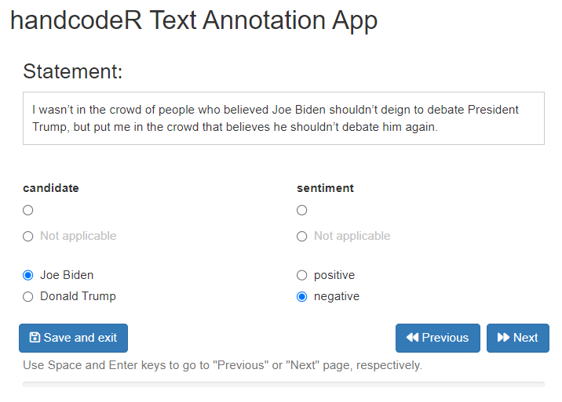

[](https://zenodo.org/badge/latestdoi/608736610)

```{r, include = FALSE}
knitr::opts_chunk$set(
  collapse = TRUE,
  warning = FALSE,
  message = FALSE,
  comment = "#>",
  fig.path = "man/figures/",
  out.width = "100%"
)
```


# handcodeR

R-Package to fascilitate the classification of textdata by hand in R.


The goal of the handcodeR package is to provide an easy to use app to annotate text data by hand. Oftentimes when we work with textdata, we rely on handcoded annotations of texts either as unit of analysis in itself, or as training and text samples for supervised machine learning tools to classify text data. handcodeR offers a shiny app that can be run within R to annotate individual texts one by one in up to three different variables. To do so, the package uses the function:

- `handcode()` opens a shiny app which allows for handcoding strings of text into pre-defined categories. You can code between one and three variables at a time. It returns a data.frame with your handcoded annotations.


I present a short step-by-step guide as well as the functions in more detail below.

## Installation

The `handcodeR` Package can be installed directly from [GitHub](https://github.com/liserman/handcodeR)

```{R, message=FALSE, warning=FALSE, results = "hide", eval=FALSE}
library(devtools) # Tools to Make Developing R Packages Easier
devtools::install_github("liserman/handcodeR")
```

## How to use this package

First, load the package

```{R, message=FALSE, warning=FALSE}
library(handcodeR) # classify texts by hand in R
```

In the following, we are going to exemplify the workflow of the package using a minimal working example.

The workflow of the package follows a simple rule:

1. If you start the coding process, initialize the coding with `handcode()` by providing a text vector of texts you whish to annotate as `data` input, and up to three named character vectors of categories you want to code. Handcode as much data as you would like and return the output data.frame via the `save and exit`-button.

2. If you want to resume coding that you have already been working on, continue the coding with `handcode()` by providing the data.frame you received as output from your last call of `handcode()` as `data` input.


### handcode

The main function of the handcodeR package is `handcode()`. `handcode()` takes either a vector of texts and up to 3 named character vectors with classification categories, or a data.frame already initialized by `handcode()` as input. The function allows users to annotate texts using the pre-defined categories in an interactive ShinyApp and returns a data.frame of the texts with their annotations.

In order to demonstrate the functionality of `handcode()`, we first use the R-package `archiveRetriever` [@Gavras2022] to download a New York Times article on the presidential debate between Joe Biden and Donald Trump in the 2020 American presidential campaign. We split the article in individual sentences which we can then annotate with `handcode()`. 

```{r download data}
# Install pacman if not already installed
if(!require(pacman)) install.packages("pacman")

# Use pacman to install and load archiveRetriever and stringr
pacman::p_load(archiveRetriever,
               stringr)

# Use the archiveRetriever to download article
nytimes_article <- scrape_urls(Urls = "http://web.archive.org/web/20201001004918/https://www.nytimes.com/2020/09/30/opinion/biden-trump-2020-debate.html",
                               Paths = c(title = "//h1[@itemprop='headline']",
                                         author = "//span[@itemprop='name']",
                                         date = "//time//text()",
                                         article = "//section[@itemprop='articleBody']//p"))

# Split up the article in different sentences
sentences <- unlist(str_split(nytimes_article$article, pattern = "(?<=\\.)\\s"))

head(sentences)
```
We can now use these sentences as input in `handcode()` to annotate the individual sentences of the New York Times article. We will annotate two variables measuring the candidate a sentence talks about and the sentiment of the statement.

```{r, eval = FALSE}
annotated <- handcode(data = sentences, 
                      candidate = c("Joe Biden", "Donald Trump"),
                      sentiment = c("positive", "negative"))
```

```{r, echo=FALSE, out.width="350px"}

```


If we want to see not only the sentence we are currently coding, but also the surrounding sentences, we can use the option `context = TRUE`. This gives us our current sentence alongside its previous and following sentence. To not generate any confusion about which sentence is currently evaluated, the surrounding sentences are displayed in grey.

```{r, eval = FALSE}
annotated <- handcode(data = sentences, 
                      candidate = c("Joe Biden", "Donald Trump"),
                      sentiment = c("positive", "negative"),
                      context = TRUE)
```

```{r, echo=FALSE, out.width="350px"}

```


We can stop the annotation process at any point by clicking on the button `save and exit`. Once we click this button, the app will close and the function returns a data.frame with our texts and annotations. 

```{r, echo=FALSE}
annotated <- tidyr::tibble(texts = sentences, candidate = factor("", levels = c("", "Not applicable", "Joe Biden", "Donald Trump")), sentiment = factor("", levels = c("", "Not applicable", "positive", "negative")))

annotated$candidate[1:2] <- c("Joe Biden", "Not applicable")
annotated$sentiment[1:2] <- c("negative", "negative")
```

```{r}
annotated
```

```{r, echo=FALSE}
annotated <- as.data.frame(annotated)
```


We can resume the annotation process at any point by using the returned data.frame from our last execution of `handcode()` as input to a new `handcode()` command. By default, the function will resume the annotation at the first text that has not been annotated yet. 

```{r, eval = FALSE}
annotated <- handcode(data = annotated,
                      context = TRUE)
```

```{r, echo=FALSE, out.width="350px"}

```


To fascilitate the classification process, `handcode()` takes the keyboard shortcuts `space` for 'previous' and `enter` for 'next'. If you go back to already coded lines of your data, the app automatically displays your previous coding, if you go to new lines of your data, the default values for your variables always are "". If the last row of your data is reached, 'next' automatically leads to the saving of the data and exit from the shiny app.  


#### Beyond the basics

By default, `handcode` uses the first uncoded line in the input data as start value. However, the option `start` allows users to specify with which observation they want to start their coding process. If we have uncoded lines of data within coded lines of data, we can also specify `start = "all_empty"` to annotate all lines that have not been coded yet in the order in which they appear.

Sometimes, we explicitly want to display texts in a random order to rule out that the context of a text within the larger body of texts influences our annotations. If we want to randomize the order in which texts are displayed, we can set the option `randomize = TRUE`. This will, however, not influence the order in which texts are sorted in the resulting output.


### Bibliography


