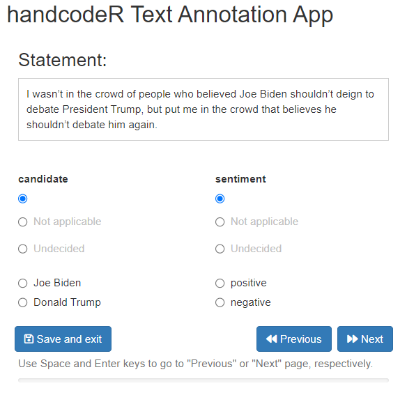

[](https://app.codecov.io/gh/liserman/handcodeR)
[](https://zenodo.org/badge/latestdoi/608736610)

# handcodeR

R-Package to facilitate the annotation of text data by hand in R.

The goal of the handcodeR package is to provide an easy to use app to
annotate text data by hand. Often times when we work with text data, we
rely on hand coded annotations of texts either as unit of analysis in
itself, or as training and test samples for supervised machine learning
tools to classify text data. handcodeR offers a Shiny-App that can be
run within R to annotate individual texts one by one in up to three
different variables. To do so, the package uses the function
`handcode()`:

- `handcode()` opens a Shiny-App which allows for hand-coding strings of
  text into pre-defined categories. You can code between one and three
  variables at a time. It returns a data frame with your coded
  annotations.

I present a short step-by-step guide as well as the functions in more
detail below.

## How to cite this package

To cite the handcodeR package, you can use:

> Isermann, Lukas. (2019). handcodeR: Text annotation app. R package
> version 0.1.0. <http://doi.org/10.5281/zenodo.8075101>.

You can also access the preferred citation as well as the bibtex entry
for the handcodeR Package via R:

``` r
citation("handcodeR")
#> To cite handcodeR in publications, please use:
#> 
#>   Isermann, Lukas. 2023. handcodeR: Text annotation app. R package
#>   version 0.1.0. https://doi.org/10.5281/zenodo.8075101
#> 
#> Ein BibTeX-Eintrag für LaTeX-Benutzer ist
#> 
#>   @Misc{,
#>     title = {handcodeR: Text annotation app},
#>     author = {Lukas Isermann},
#>     year = {2023},
#>     note = {R package version 0.1.0},
#>     doi = {10.5281/zenodo.8075101},
#>     url = {https://github.com/liserman/handcodeR},
#>   }
```

## Installation

The `handcodeR` Package can be installed directly from
[GitHub](https://github.com/liserman/handcodeR)

``` r
library(devtools) # Tools to Make Developing R Packages Easier
devtools::install_github("liserman/handcodeR")
```

## How to use this package

First, load the package

``` r
library(handcodeR) # classify texts by hand in R
```

In the following, we are going to exemplify the workflow of the package
using a minimal working example.

The workflow of the package follows a simple rule:

1.  If you start the coding process, initialize the coding with
    `handcode()` by providing a text vector of texts you wish to
    annotate as `data` input, and up to three named character vectors of
    categories you want to code. Hand code as much data as you would
    like and return the output data frame via the
    `save and exit`-button.

2.  If you want to resume coding that you have already been working on,
    continue the coding with `handcode()` by providing the data frame
    you received as output from your last call of `handcode()` as `data`
    input.

### handcode

The main function of the handcodeR package is `handcode()`. `handcode()`
takes either a vector of texts and up to 6 named character vectors with
classification categories, or a data frame already initialized by
`handcode()` as input. The function allows users to annotate texts using
the pre-defined categories in an interactive Shiny-App and returns a
data frame of the texts with their annotations.

In order to demonstrate the functionality of `handcode()`, we first use
the R-package `archiveRetriever` (Gavras and Isermann 2022) to download
a New York Times article on the presidential debate between Joe Biden
and Donald Trump in the 2020 American presidential campaign. We split
the article in individual sentences which we can then annotate with
`handcode()`.

``` r
# Install pacman if not already installed
if(!require(pacman)) install.packages("pacman")

# Use pacman to install and load archiveRetriever and stringr
pacman::p_load(archiveRetriever,
               stringr)

# Use the archiveRetriever to download article
nytimes_article <- scrape_urls(Urls = "http://web.archive.org/web/20201001004918/https://www.nytimes.com/2020/09/30/opinion/biden-trump-2020-debate.html",
                               Paths = c(title = "//h1[@itemprop='headline']",
                                         author = "//span[@itemprop='name']",
                                         date = "//time//text()",
                                         article = "//section[@itemprop='articleBody']//p"))

# Split up the article in different sentences
sentences <- unlist(str_split(nytimes_article$article, pattern = "(?<=\\.)\\s"))

head(sentences)
#> [1] "I wasn’t in the crowd of people who believed Joe Biden shouldn’t deign to debate President Trump, but put me in the crowd that believes he shouldn’t debate him again."                                                                                                                                                                                                                                                                                                                                                                                  
#> [2] "Not after Tuesday night’s horror show: a disgrace to the format, an insult to the country, a nearly pointless 90 minutes."                                                                                                                                                                                                                                                                                                                                                                                                                               
#> [3] "And, I should add, a degradation of the presidency itself, which Trump had degraded so thoroughly already."                                                                                                                                                                                                                                                                                                                                                                                                                                              
#> [4] "He put on a performance so contemptuous, so puerile, so dishonest and so across-the-board repellent that the moderator, Chris Wallace, morphed into some amalgam of elementary-school principal, child psychologist, traffic cop and roadkill."                                                                                                                                                                                                                                                                                                          
#> [5] "No matter how Wallace pleaded with Trump or admonished him, he couldn’t make him behave."                                                                                                                                                                                                                                                                                                                                                                                                                                                                
#> [6] "But then why should Wallace have an experience any different from that of Trump’s chiefs of staff, of all the other former administration officials who have fled for the hills, of the Republican lawmakers who just threw up their hands and threw away any scruples they had? Trump runs roughshod over everyone and everything, and on Tuesday night in Cleveland he ran roughshod over the idea that two presidential candidates presenting rival visions for America should do so with at least a small measure of dignity and an iota of decorum."
```

We can now use these sentences as input in `handcode()` to annotate the
individual sentences of the New York Times article. We will annotate two
variables measuring the candidate a sentence talks about and the
sentiment of the statement.

``` r
annotated <- handcode(data = sentences, 
                      candidate = c("Joe Biden", "Donald Trump"),
                      sentiment = c("positive", "negative"))
```


If we want to see not only the sentence we are currently coding, but
also the surrounding sentences, we can use the option `context = TRUE`.
This gives us our current sentence alongside its previous and following
sentence. To not generate any confusion about which sentence is
currently evaluated, the surrounding sentences are shown in gray.

``` r
annotated <- handcode(data = sentences, 
                      candidate = c("Joe Biden", "Donald Trump"),
                      sentiment = c("positive", "negative"),
                      context = TRUE)
```


If our text vector does not form a continuous text, but you nonetheless
want to provide a previous and next sentence as context, you can also
specify a vector with all previous and a vector with all next sentences
as `pre` and `post` inputs.

``` r
# Vectors of all previous and all subsequent sentences
previous <- c("", sentences[2:length(sentences)])
subsequent <- c(sentences[2:length(sentences)-1])

annotated <- handcode(data = sentences,
                      candidate = c("Joe Biden", "Donald Trump"),
                      sentiment = c("positive", "negative"),
                      context = TRUE,
                      pre = previous,
                      post = subsequent)
```

We can stop the annotation process at any point by clicking on the
button `save and exit`. Once we click this button, the app will close
and the function returns a data frame with our texts and annotations.

``` r
annotated
#> # A tibble: 58 × 3
#>    texts                                                     candidate sentiment
#>    <chr>                                                     <fct>     <fct>    
#>  1 I wasn’t in the crowd of people who believed Joe Biden s… "Joe Bid… "negativ…
#>  2 Not after Tuesday night’s horror show: a disgrace to the… "Not app… "negativ…
#>  3 And, I should add, a degradation of the presidency itsel… ""        ""       
#>  4 He put on a performance so contemptuous, so puerile, so … ""        ""       
#>  5 No matter how Wallace pleaded with Trump or admonished h… ""        ""       
#>  6 But then why should Wallace have an experience any diffe… ""        ""       
#>  7 Almost from the start, he talked over Biden, taunting hi… ""        ""       
#>  8 He interrupted him and interrupted him and then interrup… ""        ""       
#>  9 “Mr.                                                      ""        ""       
#> 10 President, I’m the moderator of this debate, and I would… ""        ""       
#> # ℹ 48 more rows
```

We can resume the annotation process at any point by using the returned
data frame from our last execution of `handcode()` as input to a new
`handcode()` command. By default, the function will resume the
annotation at the first text that has not been annotated yet.

``` r
annotated <- handcode(data = annotated,
                      context = TRUE)
```


To facilitate the classification process, `handcode()` takes the
keyboard shortcuts `space` for `previous` and `enter` for `next`. If you
go back to already coded lines of your data, the app automatically
displays your previous coding, if you go to new lines of your data, the
default values for your variables always are ““. If the last row of your
data is reached, `next` automatically leads to the saving of the data
and exit from the Shiny-App.

#### Beyond the basics

By default, `handcode` uses the first uncoded line in the input data as
start value. However, the option `start` allows users to specify with
which observation they want to start their coding process. If we have
uncoded lines of data that lie between already coded lines of data, we
can also specify `start = "all_empty"` to annotate all lines that have
not been coded yet in the order in which they appear.

Sometimes, we explicitly want to display texts in a random order to rule
out that the context of a text within the larger body of texts
influences our annotations. If we want to randomize the order in which
texts are displayed, we can set the option `randomize = TRUE`. This
will, however, not influence the order in which texts are sorted in the
resulting output.

As a default, `handcode` will display one missing category “Not
applicable”. If you want a different, or more than one missing category,
you can provide a character vector of missing categories you would like
to have displayed as `missing`. Missing categories will automatically be
displayed in gray. In the output these values will be returned with a
leading and trailing `_`.

``` r
annotated <- handcode(data = sentences, 
                      candidate = c("Joe Biden", "Donald Trump"),
                      sentiment = c("positive", "negative"),
                      missing = c("Not applicable", "Undecided"))
```



### Bibliography

<div id="refs" class="references csl-bib-body hanging-indent">

<div id="ref-Gavras2022" class="csl-entry">

Gavras, Konstantin, and Lukas Isermann. 2022. *archiveRetriever:
Retrieve Archived Web Pages from the ’Internet Archive’*.
<https://CRAN.R-project.org/package=archiveRetriever>.

</div>

</div>
