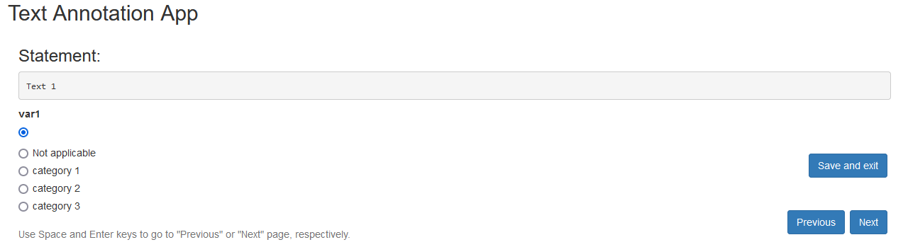
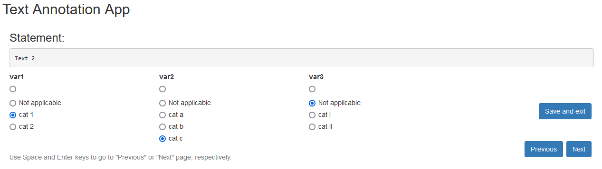

# handcodeR

R-Package to fascilitate the classification of textdata by hand in R.

The goal of the handcodeR package is to provide an easy to use app to
classify text data by hand. Oftentimes when we work with textdata, we
rely on handcoded classifications of texts either as unit of analysis in
itself, or as training and text samples for supervised machine learning
tools to classify text data. handcodeR offers a shiny app that can be
run within R to classify individual texts one by one in up to three
different variables. To do so, the package currently includes the
following two functions:

- `init_data` initializes a dataframe to be passed to handcode(). The
  function takes a vector of texts and between one and three named
  vectors of categories as input. It returns a dataframe that can be
  used as data input in handcode().
- `handcode` opens a shiny app which allows for handcoding strings of
  text into pre-defined categories. You can code between one and three
  variables at a time. It returns an updated dataframe with your
  handcoded classifications.

I present a short step-by-step guide as well as the functions in more
detail below.

## Installation

The `handcodeR` Package can be installed directly from
[GitHub](https://github.com/liserman/handcodeR)

``` r
library(devtools) # Tools to Make Developing R Packages Easier
devtools::install_github("liserman/handcodeR")
```

## How to use this package

First, load the package

``` r
library(handcodeR) # classify texts by hand in R
```

In the following, we are going to exemplify the workflow of the package
using a minimal working example.

The workflow of the package follows a simple rule:

1.  Initialize the dataset via `init_data`

2.  Handcode your data via `handcode`

These two steps where devided into two separate functions, in order to
fascilitate the classification of you texts in multiple sessions.
Initially, the function `handcode` takes the output of `init` data as
input. If you want to pause and resume your classification process, you
can save your classifications and use the output of `handcode` as input
to a new `handcode` command.

### init_data

With `init_data` we initialize the texts and variables we want to
classify. The function takes your vector of texts and between one and
three named character vectors that indicate different variables and
their categories you wish to classify.

``` r
# Textvector to classify
texts <- c("Text 1", "Text 2", "Text 3", "Text 4")

# Initialize dataframe
data <- init_data(texts = texts, var1 = c("category 1", "category 2", "category 3"))
```

The `init_data` function initializes a dataframe with the texts in the
first column and one column for each of the variables you wish to
classify.

    #>    texts var1
    #> 1 Text 1     
    #> 2 Text 2     
    #> 3 Text 3     
    #> 4 Text 4

The classification variables are saved as empty factor variables with
the different categories for each variable as factor levels. Here, the
function automatically adds the levels “” and “not applicable”.

``` r
levels(data$var1)
#> [1] ""               "Not applicable" "category 1"     "category 2"    
#> [5] "category 3"
```

If you want to classify more than one variable, you can initalize your
dataframe as follows:

``` r
# Initalize dataframe with three classification variables
data_3cat <- init_data(texts = texts, var1 = c("cat 1", "cat 2"), var2 = c("cat a", "cat b", "cat c"), var3 = c("cat I", "cat II"))
```

    #>    texts var1 var2 var3
    #> 1 Text 1               
    #> 2 Text 2               
    #> 3 Text 3               
    #> 4 Text 4

### handcode

The main function of the handcodeR package is `handcode`. `handcode`
takes the initialized dataset from `init_data` as input and starts a
shiny app that allows users to classify texts into the in `init_data`
pre-defined categories.

``` r
data_new <- handcode(data)
```



After finishing the classification process you can click on ‘Save and
exit’ to returns a dataframe with your classifications.

    #>    texts           var1
    #> 1 Text 1          cat 1
    #> 2 Text 2          cat 1
    #> 3 Text 3          cat 2
    #> 4 Text 4 Not applicable

#### Classifying more than one variable

Dependent on the number of variables you gave in the initialization of
the input data via `init_data`, you can classify up to three variables
with handcode.

``` r
data_3cat_new <- handcode(data_3cat)
```



    #>    texts           var1  var2           var3
    #> 1 Text 1          cat 1 cat b         cat II
    #> 2 Text 2          cat 1 cat c Not applicable
    #> 3 Text 3          cat 2 cat b         cat II
    #> 4 Text 4 Not applicable cat a          cat I

#### Beyond the basics

By default, `handcode` uses the first uncoded line in the input data as
start value. However, the option `start` allows users to specify with
which observation they want to start their coding process. To
fascilitate the classification process, `handcode` takes the keyboard
shortcuts `space` for ‘previous’ and `enter` for ‘next’. If you go back
to already coded lines of your data, the app automatically displays your
previous coding, if you go to new lines of your data, the default values
for your variables always are ““. If the last row of your data is
reached, ‘next’ automatically leads to the saving of the data and exit
from the shiny app.
