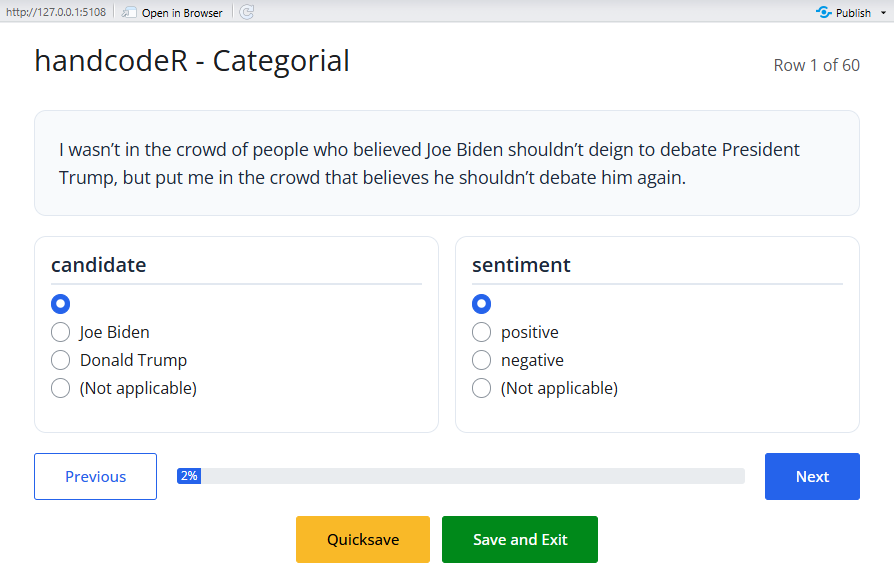
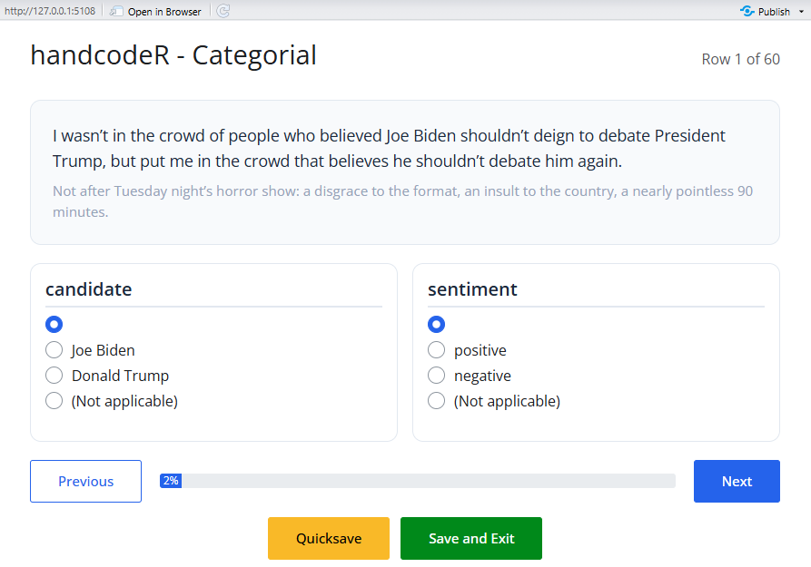
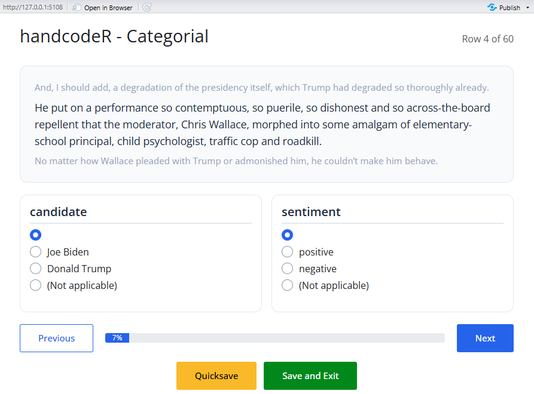
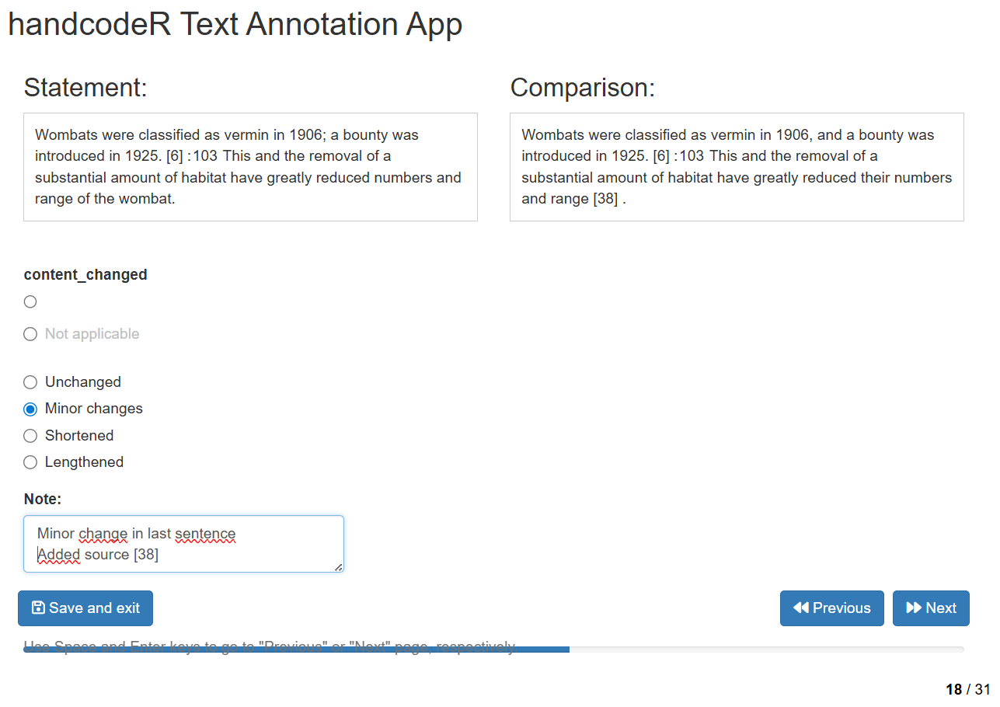
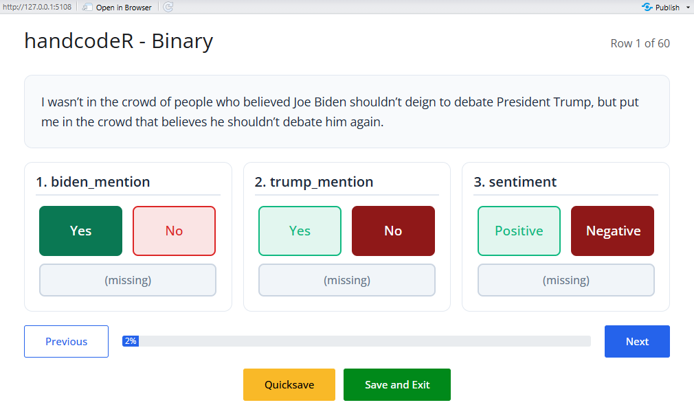

# handcodeR 

[](https://app.codecov.io/gh/liserman/handcodeR)
[](https://cran.r-project.org/package=handcodeR)
[](https://cran.r-project.org/package=handcodeR)
[](https://cran.r-project.org/package=handcodeR)
[](https://cran.r-project.org/package=handcodeR)
[](https://zenodo.org/badge/latestdoi/608736610)

# handcodeR

R-Package to facilitate the annotation of text data by hand in R.

The goal of the handcodeR package is to provide an easy-to-use app to
annotate text data by hand. Often times when we work with text data, we
rely on hand-coded annotations of texts either as a unit of analysis in
itself, or as training and test samples for supervised machine learning
tools to classify text data. handcodeR offers Shiny-Apps that can be run
within R to annotate individual texts one by one. The package provides
two complementary entry points:

- `handcode()` opens a Shiny-App for **categorial annotation**, allowing
  you to code each text into pre-defined categories across an arbitrary
  number of classification variables. It also supports **side-by-side
  comparison** of two text vectors.
- `handcode_binary()` opens a Shiny-App for **two-choice (binary)
  annotation**, where each variable presents exactly two color-coded
  options (e.g. positive/negative). It supports keyboard shortcuts and
  multi-/single-factorial coding.

Both functions return a data frame with your coded annotations, support
resuming an existing coding session, optional quicksave snapshots,
free-text notes, randomized order, and contextual display of preceding
and following texts.

I present a short step-by-step guide as well as the functions in more
detail below.

## How to cite this package

To cite the handcodeR package, you can use:

> Isermann, Lukas and Klingenspohr, Dennis. (2026). handcodeR: Text
> annotation app. R package version 0.2.1.
> <http://doi.org/10.5281/zenodo.8075100>.

You can also access the preferred citation as well as the bibtex entry
for the handcodeR Package via R:

```r
citation("handcodeR")
#> To cite handcodeR in publications, please use:
#>
#>   Isermann, Lukas and Klingenspohr, Dennis. 2026. handcodeR: Text
#>   annotation app. R package version 0.2.1.
#>   https://doi.org/10.5281/zenodo.8075100
#>
#> Ein BibTeX-Eintrag für LaTeX-Benutzer ist
#>
#>   @Misc{,
#>     title = {handcodeR: Text annotation app},
#>     author = {Lukas Isermann and Dennis Klingenspohr},
#>     year = {2026},
#>     note = {R package version 0.2.1},
#>     doi = {10.5281/zenodo.8075100},
#>     url = {https://github.com/liserman/handcodeR},
#>   }
```

## Installation

A stable version of `handcodeR` can be directly accessed on CRAN:

```r
install.packages("handcodeR", force = TRUE)
```

To install the latest development version of `handcodeR` directly from
[GitHub](https://github.com/liserman/handcodeR) use:

```r
library(devtools) # Tools to Make Developing R Packages Easier
devtools::install_github("liserman/handcodeR", force = TRUE)
```

## How to use this package

First, load the package

```r
library(handcodeR) # classify texts by hand in R
```

In the following, we are going to exemplify the workflow of the package
using a minimal working example.

The workflow of the package follows a simple rule:

1.  **Starting a new coding session:**
    - Initialize coding with `handcode()` (categorial) or
      `handcode_binary()` (two-choice) by providing a **character
      vector** of texts you wish to annotate as the `data` input.
    - Supply one or more **named character vectors** defining the
      categories you want to code.
    - Hand-code as much data as you like and save your progress by
      clicking the **“Save and exit”** button. This will return a data
      frame containing your annotations.
2.  **Resuming an existing coding session:**
    - Continue coding by providing the **data frame output** from your
      previous session as the `data` input.
    - This allows you to pick up where you left off without losing any
      previous annotations.
    - To resume from a `quicksave` snapshot, `load()` the `.RData` file
      and pass the restored object back as `data`.

### handcode

The main function of the **handcodeR** package is `handcode()`.

`handcode()` can take either:

- A **character vector** of texts along with one or more **named
  character vectors** defining classification categories, or
- A **data frame** previously returned by `handcode()` to resume an
  existing coding session.

The function launches an interactive **Shiny app** that allows users to
annotate texts using the predefined categories. Once coding is complete,
`handcode()` returns a **data frame** containing the texts along with
their corresponding annotations.

To demonstrate the functionality of `handcode()`, we first use the R
package
[`archiveRetriever`](https://github.com/liserman/archiveRetriever) to
download a New York Times article covering the presidential debate
between Joe Biden and Donald Trump during the 2020 U.S. presidential
campaign. We then split the article into individual sentences, which can
be annotated using `handcode()`.

```r
# Install pacman if not already installed
if (!require(pacman)) install.packages("pacman")

# Use pacman to install and load archiveRetriever and stringr
pacman::p_load(archiveRetriever,
               stringr)

# Use the archiveRetriever to download article
nytimes_article <- scrape_urls(Urls = "http://web.archive.org/web/20201001004918/https://www.nytimes.com/2020/09/30/opinion/biden-trump-2020-debate.html",
                               Paths = c(title = "//h1[@itemprop='headline']",
                                         author = "//span[@itemprop='name']",
                                         date = "//time//text()",
                                         article = "//section[@itemprop='articleBody']//p"))

# Split up the article in different sentences
sentences <- unlist(str_split(nytimes_article$article, pattern = "(?<=(?<!Mr)[\\.!?])\\s"))

head(sentences)
#> [1] "I wasn’t in the crowd of people who believed Joe Biden shouldn’t deign to debate President Trump, but put me in the crowd that believes he shouldn’t debate him again."
#> [2] "Not after Tuesday night’s horror show: a disgrace to the format, an insult to the country, a nearly pointless 90 minutes."
#> [3] "And, I should add, a degradation of the presidency itself, which Trump had degraded so thoroughly already."
#> [4] "He put on a performance so contemptuous, so puerile, so dishonest and so across-the-board repellent that the moderator, Chris Wallace, morphed into some amalgam of elementary-school principal, child psychologist, traffic cop and roadkill."
#> [5] "No matter how Wallace pleaded with Trump or admonished him, he couldn’t make him behave."
#> [6] "But then why should Wallace have an experience any different from that of Trump’s chiefs of staff, of all the other former administration officials who have fled for the hills, of the Republican lawmakers who just threw up their hands and threw away any scruples they had?"
```

We can now use these sentences as input to `handcode()` to annotate the
individual sentences from the New York Times article.

In this example, we will annotate **two variables**:

1.  The **candidate** a sentence refers to.
2.  The **sentiment** of the statement.

```r
annotated <- handcode(data = sentences,
                      candidate = c("Joe Biden", "Donald Trump"),
                      sentiment = c("positive", "negative"))
```



If we want to see not only the sentence currently being coded but also
the surrounding sentences, we can use the option `context = TRUE`. This
displays the current sentence along with its **previous** and
**following** sentences. To avoid confusion about which sentence is
being evaluated, the surrounding sentences are shown in **gray**.

You can also pass `context = "FLEX"` to render a runtime checkbox in the
app that lets you toggle the context display on and off while coding.

```r
annotated <- handcode(data = sentences,
                      candidate = c("Joe Biden", "Donald Trump"),
                      sentiment = c("positive", "negative"),
                      context = TRUE)
```



If your text vector does not form a continuous sequence, but you still
want to provide previous and next sentences as context, you can specify
**custom vectors** for the surrounding sentences using the `pre` and
`post` arguments.

```r
# Vectors of all previous and all subsequent sentences
previous <- c("", sentences[2:length(sentences)])
subsequent <- c(sentences[2:length(sentences)-1])

annotated <- handcode(data = sentences,
                      candidate = c("Joe Biden", "Donald Trump"),
                      sentiment = c("positive", "negative"),
                      context = TRUE,
                      pre = previous,
                      post = subsequent)
```

You can stop the annotation process at any point by clicking the **“Save
and exit”** button. Once this button is clicked, the app shows a
confirmation dialog, closes, and `handcode()` returns a **data frame**
containing your texts along with the corresponding annotations.

```r
annotated
#> # A tibble: 60 × 3
#>    texts                                                     candidate sentiment
#>    <chr>                                                     <fct>     <fct>
#>  1 I wasn’t in the crowd of people who believed Joe Biden s… "Joe Bid… "negativ…
#>  2 Not after Tuesday night’s horror show: a disgrace to the… "_Not ap… "negativ…
#>  3 And, I should add, a degradation of the presidency itsel… ""        ""
#>  4 He put on a performance so contemptuous, so puerile, so … ""        ""
#>  5 No matter how Wallace pleaded with Trump or admonished h… ""        ""
#>  6 But then why should Wallace have an experience any diffe… ""        ""
#>  7 Trump runs roughshod over everyone and everything, and o… ""        ""
#>  8 Almost from the start, he talked over Biden, taunting hi… ""        ""
#>  9 He interrupted him and interrupted him and then interrup… ""        ""
#> 10 “Mr. President, I’m the moderator of this debate, and I … ""        ""
#> # ℹ 50 more rows
```

You can resume the annotation process at any time by using the **data
frame** returned from your previous `handcode()` session as the `data`
input in a new call to `handcode()`. By default, the function resumes
annotation at the **first text** that has not yet been annotated.

```r
annotated <- handcode(data = annotated,
                      context = TRUE)
```



To facilitate the classification process, `handcode()` supports the
following keyboard shortcuts:

- **Space**: go to the **previous** text.
- **Enter**: go to the **next** text.

When navigating to previously coded lines, the app automatically
displays your **existing annotations**. For new lines, the default
values for all annotation variables are `""`. On the **last row**,
pressing **Enter** keeps you on the last row (your selections are saved
continuously); click **“Save and Exit”** or simply close the app to
finish and return your data to R.

### Comparing texts

You can also use **handcodeR** to compare texts against each other. To
do so, use the optional `comparison` argument to pass a second text
vector. Each element of `comparison` will be displayed alongside the
corresponding element of `data`, allowing you to annotate how the two
texts relate or differ.

To illustrate this, we again use the R package
[`archiveRetriever`](https://github.com/liserman/archiveRetriever) to
scrape the individual paragraphs of the Wikipedia article on **Wombats**
at two different points in time – **July 2022** and **March 2024**. We
then use `handcode()` to compare the paragraphs and identify changes
between the two versions.

```r
# Download paragraphs of Wikipedia article on Wombats for July 2022 and March 2024
wombat_1 <- scrape_urls(Urls = "https://web.archive.org/web/20220703070930/https://en.wikipedia.org/wiki/Wombat",
                        Paths = c(text = "//text()"),
                        collapse = "//div[@class='mw-body-content mw-content-ltr']//p")

wombat_2 <- scrape_urls(Urls = "https://web.archive.org/web/20240329193637/https://en.wikipedia.org/wiki/Wombat",
                        Paths = c(text = "//text()"),
                        collapse = "//div[@class='mw-content-ltr mw-parser-output']//p")

# Delete empty first row
wombat_1 <- wombat_1[-1,]
wombat_2 <- wombat_2[-1,]
```

After downloading the data, we can use `handcode()` to compare the
individual paragraphs.  
We supply the **original version** of the Wikipedia article as the
`data` input, and the **revised version** of the article as the
`comparison` input. This allows us to view both versions side by side in
the Shiny app and annotate how each paragraph has changed over time.

```r
comparison <- handcode(data = wombat_1$text,
                       comparison = wombat_2$text,
                       content_changed = c("Unchanged", "Minor changes", "Shortened", "Lengthened")
                       )
```


As before, you can use the option `context = TRUE` to display the
preceding and following text for both the `data` and the `comparison`
input.

If you want to provide custom context instead of relying on
automatically adjacent text, you can use `pre_comparison` and
`post_comparison` to specify custom vectors to display before and after
each comparison text—analogous to the `pre` and `post` arguments for the
main `data` input.

### Adding notes

The handcodeR package also allows you to add an additional column for
free-text notes.  
To enable this feature, set `add_notes = TRUE`. This lets you enter
comments or observations alongside your coded categories.

```r
comparison <- handcode(data = wombat_1$text,
         comparison = wombat_2$text,
         content_changed = c("Unchanged", "Minor changes", "Shortened", "Lengthened"),
         add_notes = TRUE
)
```



By default, this option only needs to be set once at the beginning of a
new annotation process.  
If you use `handcode()` to resume an existing annotation process, the
information is automatically taken from the data frame provided in
`data`, so you do not need to specify `add_notes` again. The same
applies to `handcode_binary()`.

### `handcode()` arguments

| Arg               | Default               | Description                                                                                                                                                                                                       |
| ----------------- | --------------------- | ----------------------------------------------------------------------------------------------------------------------------------------------------------------------------------------------------------------- |
| `data`            | —                     | Character vector of texts to annotate, **or** a `data.frame` from a previous `handcode()` session (first column must be `texts`, character).                                                                      |
| `...`             | —                     | Named character vectors defining classification categories per variable. Each name becomes a column in the output. Unnamed entries are auto-named `cat1`, `cat2`, …                                               |
| `start`           | `"first_empty"`       | Row to begin at. Numeric = explicit row index. `"first_empty"` = first row with no completed classifications across all variables. `"all_empty"` = filter the workload to uncoded rows only and restart at row 1. |
| `randomize`       | `FALSE`               | If `TRUE`, shuffle order of _uncoded_ rows only. Output data frame retains original row order.                                                                                                                    |
| `context`         | `FALSE`               | `TRUE` = always show before/after text, `FALSE` = never show, `"FLEX"` = runtime toggle.                                                                                                                          |
| `missing`         | `c("Not applicable")` | Character vector of missing-value labels. Categories displayed in gray. Stored internally as `_label_`.                                                                                                           |
| `pre`             | `NULL`                | Per-row previous-text override, length `nrow(data)`. Falls back to neighbouring rows when `NULL` and `context != FALSE`.                                                                                          |
| `post`            | `NULL`                | Per-row next-text override, length `nrow(data)`. Falls back to neighbouring rows when `NULL` and `context != FALSE`.                                                                                              |
| `comparison`      | `NULL`                | Optional second character vector displayed side-by-side with `data`. Enables comparison mode.                                                                                                                     |
| `pre_comparison`  | `NULL`                | Per-row previous-text override for the `comparison` vector.                                                                                                                                                       |
| `post_comparison` | `NULL`                | Per-row next-text override for the `comparison` vector.                                                                                                                                                           |
| `quicksave`       | `NULL`               | `NULL` (no Quicksave button) or a path to an **existing** directory. When a directory is given, a Quicksave button writes `<name>_quicksave_<timestamp>.RData` snapshots there; the directory is never created automatically. |
| `add_notes`       | `FALSE`               | If `TRUE`, render a per-row notes textarea and persist a `notes` column in the output.                                                                                                                            |
| `enable_numeric`  | `FALSE`               | If `TRUE`, numeric keys `1`–`9` cycle through the radio choices of the variable at that position. At most 9 classification variables supported.                                                                   |

### Binary annotation with `handcode_binary()`

For workflows where each variable has exactly **two possible values**
(e.g. yes/no, positive/negative, supports/opposes), the package provides
`handcode_binary()`. The function shares the same data contract and
resume behavior as `handcode()`, but renders each variable as a pair of
large color-coded buttons, optimized for high-throughput coding.

Each classification variable must be a **named character vector of
length 2**. The first element is rendered on the **left**, the second on
the **right**.

```r
binary_annotated <- handcode_binary(data = sentences,
                                    biden_mention   = c("Yes", "No"),
                                    trump_mention   = c("Yes", "No"),
                                    sentiment       = c("Positive", "Negative"))
```



#### Quickcode mode

For single-variable workflows that require maximum throughput, set
`quickcode = TRUE`. This collapses the variable into a single
three-button row — **1** (left), **2** (right), **3** (missing) — and
automatically advances to the next row as soon as any button is pressed.
`quickcode` is mutually exclusive with `enable_numeric` and requires
`multifactorial = TRUE` (the default).

```r
binary_annotated <- handcode_binary(data = sentences,
                                    sentiment = c("Positive", "Negative"),
                                    quickcode = TRUE)
```

#### Comparison mode

`handcode_binary()` also supports side-by-side comparison of two text
vectors via the `comparison` argument, identical to `handcode()`. Pass a
second character vector as `comparison` to render both texts in parallel
while coding. Resume a session that already has a `comparison` column by
passing the previous output data frame directly.

```r
binary_comparison <- handcode_binary(data = wombat_1$text,
                                     comparison = wombat_2$text,
                                     content_changed = c("Yes", "No"))
```

#### `handcode_binary()` arguments

| Arg               | Default               | Description                                                                                                                                                                                                                                       |
| ----------------- | --------------------- | ------------------------------------------------------------------------------------------------------------------------------------------------------------------------------------------------------------------------------------------------- |
| `data`            | —                     | Character vector of texts to annotate, **or** a `data.frame` from a previous `handcode_binary()` session (first column must be `texts`, character).                                                                                               |
| `...`             | —                     | Named character vectors of **exactly length 2**, defining the left/right button labels per variable. Empty strings rejected. Unnamed entries are auto-named `bin1`, `bin2`, …                                                                     |
| `start`           | `"first_empty"`       | Row to begin at. Numeric = explicit row index. `"first_empty"` = first row with no completed classifications across all variables. `"all_empty"` = filter the workload to uncoded rows only and restart at row 1.                                 |
| `randomize`       | `FALSE`               | If `TRUE`, shuffle the order of _uncoded_ rows only. Single logical.                                                                                                                                                                              |
| `context`         | `FALSE`               | `TRUE` = always show before/after text, `FALSE` = never show, `"FLEX"` = runtime toggle.                                                                                                                                                          |
| `missing`         | `c("Not applicable")` | Single missing-value label (binary mode requires exactly one — the UI has one shared `(missing)` button per variable). Stored internally as `_label_`.                                                                                            |
| `pre`             | `NULL`                | Per-row previous-text override, length `nrow(data)`. Falls back to neighbouring rows when `NULL` and `context != FALSE`.                                                                                                                          |
| `post`            | `NULL`                | Per-row next-text override, length `nrow(data)`. Falls back to neighbouring rows when `NULL` and `context != FALSE`.                                                                                                                              |
| `quicksave`       | `NULL`               | `NULL` (no Quicksave button) or a path to an **existing** directory. When a directory is given, a Quicksave button writes `<name>_quicksave_<timestamp>.RData` snapshots there; the directory is never created automatically.                            |
| `multifactorial`  | `TRUE`                | If `TRUE`, each variable is coded independently. If `FALSE`, selecting the _left_ value on one variable force-sets all other (non-missing) variables to their _right_ value, enforcing a single positive-class assignment per row.                |
| `enable_numeric`  | `FALSE`               | If `TRUE`, keys `1`–`9` click the left button of the variable at that position (1 = first variable, 2 = second, …). Caps the number of classification variables at 9. Mutually exclusive with `quickcode`.                                        |
| `quickcode`       | `FALSE`               | If `TRUE`, renders three side-by-side keys (1 = left, 2 = right, 3 = missing) and auto-advances to the next row on selection. Requires exactly one classification variable and `multifactorial = TRUE`. Mutually exclusive with `enable_numeric`. |
| `colors`          | `list()`              | Named list overriding the left/right button colors. Defaults: `list(left = "#10b981", right = "#dc2626")`. Both must be valid 6-digit hex (`^#[0-9A-Fa-f]{6}$`). Partial overrides supported (e.g. `list(left = "#0066cc")`).                     |
| `comparison`      | `NULL`                | Optional second character vector displayed side-by-side with `data`. Enables comparison mode.                                                                                                                                                     |
| `pre_comparison`  | `NULL`                | Per-row previous-text override for the `comparison` vector.                                                                                                                                                                                       |
| `post_comparison` | `NULL`                | Per-row next-text override for the `comparison` vector.                                                                                                                                                                                           |
| `add_notes`       | `FALSE`               | If `TRUE`, render a per-row notes textarea and persist a `notes` column in the output.                                                                                                                                                            |

The standard navigation shortcuts (Space = previous, Enter = next) and
all `handcode()` features — `context`, `pre`/`post`, `randomize`,
`start`, `add_notes`, `quicksave`, resume — apply to
`handcode_binary()` as well.

### Saving your work

#### Closing the app always returns your data

However you close the app — clicking **“Save and Exit”**, closing the
browser tab, or losing the R connection — the annotated data is returned
to your R session as the function’s return value. So in-progress work is
never lost; just assign the call to a variable:

```r
annotated <- handcode(data = sentences,
                      sentiment = c("positive", "neutral", "negative"))
```

Clicking **“Save and Exit”** additionally shows a confirmation dialog so
you know your data came back before the tab closes.

#### Quicksave

The optional `quicksave` argument enables an on-disk snapshot button.
Pass a path to an **existing** directory, e.g. `quicksave = "my_saves"`,
and a **“Quicksave”** button appears in the app. Clicking it writes a
timestamped `.RData` snapshot of the current annotation state to that
directory **without** ending the session. Files are named
`<object_name>_quicksave_<timestamp>.RData`, so snapshots accumulate and
multiple checkpoints can coexist for the same object.

```r
annotated <- handcode(data = sentences,
                      sentiment = c("positive", "neutral", "negative"),
                      quicksave = "my_saves")
```

`quicksave` defaults to `NULL` (no button, nothing written to disk). If
the directory does not exist, the call stops with an error rather than
creating it. To resume from a quicksave file later, load it manually and
pass it back to `handcode()`:

```r
load("my_saves/sentences_quicksave_1714387234.RData")
annotated <- handcode(data = sentences, sentiment = c("positive", "neutral", "negative"))
```
